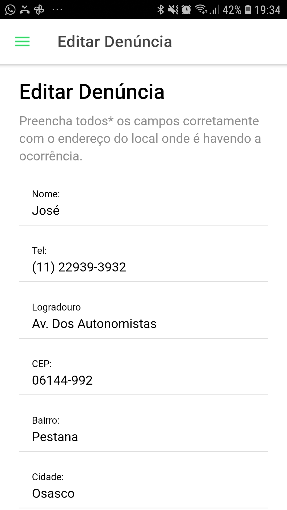

# APSProject
Trabalho (Mobile) do 8º Semestre de Ciência da Computação.

## Descrição

    
    
    

Estamos desenvolvendo um aplicativo mobile chamado City Clean, onde o usuário pode denunciar locais públicos com acúmulo de lixo.  
Sabemos que o acúmulo de lixo em locais públicos podem causar diversos problemas, como inundações, animais portadores de doenças e mau cheiro. Para reduzirmos
esses inconvenientes podemos realizar denúncias através do app **City Clean**, onde o usuário poderá fornecer o endereço e uma descrição do problema, esses dados
serão armazenados em nosso banco para que as autoridades responsáveis possam visualizar e corrigir esses impasses.

## Clonando o projeto ヽ(✿ﾟ▽ﾟ)ノ
Antes de tudo certifique-se que você possui em sua máquina todas as ferramentas necessárias para executar a aplicação, se preferir
pode usar a própria documentação do [IONIC](https://ionicframework.com/docs/intro/environment) para preparar seu workspace.

Com tudo pronto, basta clonar o projeto e executar o `npm i` para instalar todas as dependências do projeto.

## Executando o projeto ( ﾉ ﾟｰﾟ)ﾉ
Para usar o Live Reload do projeto em seu navegador, execute o `ionic serve`, ele irá abrir automaticamente uma aba no endereço **http://localhost:8100/**,
caso queira abri-lo em seu simulador do Android Studio execute `ionic capacitor run android -l`.

## Buildando o projeto Android (☞ﾟヮﾟ)☞
Execute os seguintes comandos:

1. `ionic build` Gerar o build da aplicação e a pasta **www**;
2. `ionic cap add android` Para adicionar a plataforma Android ao projeto;
3. `ionic cap copy` Copiar o build padrão para as plataformas mobile;
4. `ionic cap sync` Sincronizar as dependencias do **package.json**;
5. `ionic cap build android --prod --release` Realizar o build para a plataforma Android;
6. Após todos esses comandos o Android Studio deverá abrir, depois que ele fazer o build do projeto, clique em **Make Project**;
7. O APK será criado na pasta "android/app/build/outputs/debug/app-debug.apk".

## Atualizações
- v1.0 Conforme fomos adicionando mais conteúdo ao projeto irei atualizar esse repositório, ainda há muita coisa a ser feita.
- v2.0 O MVP está completo!! O aplicativo já está interagindo com o [back-end](https://github.com/J-Mateus/aps-api).

Em breve mais novidades. Até mais!! （。＾▽＾）